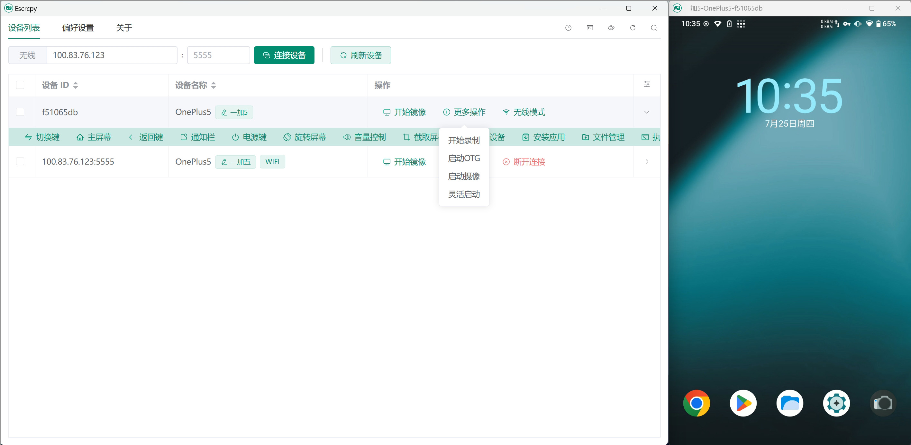

  

# Escrcpy

📱 使用图形化的 Scrcpy 显示和控制您的 Android 设备，由 Electron 驱动。[English Document](https://github.com/viarotel-org/escrcpy/blob/main/README.md)

  

## 特点

- 🏃 同步：得益于 Web 技术，将更快速的与 Scrcpy 保持同步
- 🤖 自动化：自动连接设备、自动执行镜像、自定义脚本、计划任务
- 💡 定制化：多设备管理、独立配置、自定义备注、配置导入导出
- 📡 无线：通过扫描二维码快速连接
- 🔗 反向供网：Gnirehtet 反向供网
- 🪟 窗口编排：可视化拖拽界面，精确控制多设备窗口布局，支持自定义位置和尺寸
- 🎨 主题：浅色模式、深色模式、跟随系统切换
- 😎 轻巧度：本机支持，仅显示设备屏幕
- ⚡️ 性能：30~120 帧每秒，取决于设备
- 🌟 质量：1920×1080 或更高
- 🕒 低延迟：35~70 毫秒
- 🚀 快速启动：显示第一张图片仅需约 1 秒钟
- 🙅‍♂️ 非侵入性：不会在安卓设备上留下任何安装文件
- 🤩 用户收益：无需账户、无广告、无需互联网连接
- 🗽 自由：免费且开源软件

## 安装

### 通过发布的软件包手动安装

查看 [发布地址](https://github.com/viarotel-org/escrcpy/releases)

### macOS 可以通过 Homebrew 安装

参阅 [homebrew-escrcpy](https://github.com/viarotel-org/homebrew-escrcpy)

## 文档

- [快速上手](https://viarotel.eu.org/zhHans/guide/started)
- [快捷键](https://viarotel.eu.org/zhHans/reference/scrcpy/shortcuts)
- [设备操作](https://viarotel.eu.org/zhHans/guide/operation)
- [偏好设置](https://viarotel.eu.org/zhHans/guide/preferences)
- [反向供网](https://viarotel.eu.org/zhHans/reference/gnirehtet/)

## 开发人员

如果你是开发人员，希望运行或帮助改进该项目请参阅 [开发文档](https://github.com/viarotel-org/escrcpy/blob/main/develop.md)

## 获得帮助

因为是开源项目 全靠爱发电 所以支持有限 更新节奏不固定

- [常见问题](https://viarotel.eu.org/zhHans/help/escrcpy)
- [反馈问题](https://github.com/viarotel-org/escrcpy/issues)
- [联系邮箱](viarotel@qq.com)

## 下一步做什么？

[里程碑](https://viarotel.eu.org/zhHans/guide/milestones)

## 致谢

该项目的诞生离不开以下开源项目

- [scrcpy](https://github.com/Genymobile/scrcpy)
- [adbkit](https://github.com/DeviceFarmer/adbkit)
- [electron](https://www.electronjs.org/)
- [vue](https://vuejs.org/)
- [gnirehtet](https://github.com/Genymobile/gnirehtet/)

## 捐赠项目

如果该项目帮到你的话，可以请我喝杯咖啡，让我更有精神完善该项目 😛

  
  
  

## 贡献者

感谢他们的所做的一切贡献！

[Contributors](https://github.com/viarotel/escrcpy/graphs/contributors)

## Star 历史

