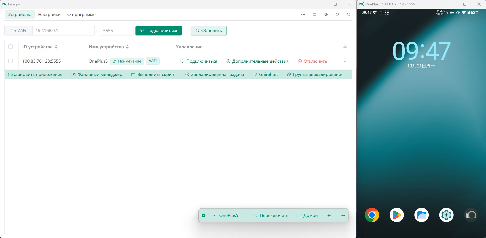

<div style="display:flex;">
  
</div>

# Escrcpy

[](https://gitcode.com/viarotel-org/escrcpy)
[](https://gitee.com/viarotel-org/escrcpy)
[](https://github.com/viarotel-org/escrcpy)

📱 Отображение и управление вашим Android-устройством с графическим интерфейсом Scrcpy на базе Electron. [English](https://github.com/viarotel-org/escrcpy/blob/main/README.md)

<div style="display:flex;">
  
</div>

## Особенности

- 🏃 Синхронность: Использование веб-технологий для более быстрой синхронизации с Scrcpy
- 🤖 Автоматизация: Автоподключение устройств, автоисполнение изображений, пользовательские скрипты, запланированные задачи
- 💡 Настройка: Управление несколькими устройствами, независимые конфигурации, пользовательские заметки, импорт/экспорт настроек
- 📡 Беспроводная связь: Быстрое подключение путём сканирования QR-кода
- 🔗 Обратный тетеринг: Обратный тетеринг с помощью Gnirehtet
- 🎨 Темы: Светлая тема, темная тема, переключение в зависимости от системы
- 😎 Легковесность: Нативная поддержка, отображает только экран устройства
- ⚡️ Производительность: От 30 до 120 кадров в секунду в зависимости от устройства
- 🌟 Качество: 1920×1080 или выше
- 🕒 Низкая задержка: 35~70 мс
- 🚀 Быстрый запуск: Отображение первого изображения примерно за 1 секунду
- 🙅‍♂️ Ненавязчивость: Нет остаточных установок на Android-устройстве
- 🤩 Пользовательские преимущества: Без аккаунта, без рекламы, не требуется интернет
- 🗽 Бесплатно и с открытым исходным кодом

## Установка

### Ручная установка через выпущенные пакеты

Просмотреть [адрес выпуска](https://github.com/viarotel-org/escrcpy/releases)

### macOS можно установить через Homebrew

См. [homebrew-escrcpy](https://github.com/viarotel-org/homebrew-escrcpy)

## Быстрый старт

### Подключение по USB

> Примечание: Если телефон запрашивает разрешение на отладку, нажмите "Разрешить"

1. Включите режим разработчика и отладку по USB на вашем Android-телефоне
2. Откройте Escrcpy и подключите ваш Android-телефон к компьютеру
3. В списке устройств Escrcpy должно обнаружить ваш телефон, нажмите "Начать зеркалирование"
4. Наслаждайтесь!

### Подключение по Wi-Fi

#### Подключение с помощью QR-кода

1. Выполните шаги 1-2 из USB-подключения
2. Включите и войдите в беспроводную отладку в режиме разработчика
3. Нажмите "Сопряжение устройства с помощью QR-кода"
4. Начните пользоваться!

#### Подключение через IP-адрес

> Примечание: Если первоначальное беспроводное подключение не удалось, возможно, потребуется беспроводное сопряжение. Обратитесь к разделу [FAQ](#FAQ)
>
> Примечание: Необходимо включить беспроводную отладку и получить беспроводной адрес устройства (обычно это IP-адрес, назначенный при подключении к WiFi) и номер порта (по умолчанию 5555) на странице беспроводной отладки

1. Выполните шаги 1-2 из USB-подключения
2. Введите полученный IP-адрес устройства и номер порта в Escrcpy, затем нажмите подключить устройство
3. К этому моменту список устройств Escrcpy должен обнаружить ваш телефон, нажмите начать трансляцию
4. Начните пользоваться!

### macOS и Linux

> Примечание: Эти платформы не имеют встроенного [Scrcpy](https://github.com/Genymobile/scrcpy), необходимо установить его вручную

**Обновление: В Escrcpy@1.27.1+ бинарные файлы scrcpy предварительно интегрированы, что устраняет необходимость в ручной установке scrcpy.**

1. Ознакомьтесь с [документацией по установке](https://github.com/Genymobile/scrcpy/blob/master/doc/linux.md) для Linux
2. Ознакомьтесь с [документацией по установке](https://github.com/Genymobile/scrcpy/blob/master/doc/macos.md) для macOS
3. После успешной установки зависимостей следуйте шагам из разделов "Подключение по USB" и "Подключение по Wi-Fi"

### Обратный тетеринг Gnirehtet

> Примечание: macOS не имеет встроенного Gnirehtet. Необходимо установить его вручную, чтобы использовать эту функцию [Руководство по установке](https://github.com/Genymobile/gnirehtet).

Gnirehtet встроен в приложения для Windows и Linux, чтобы обеспечить обратный тетеринг с ПК на Android-устройства.

## Разработчики

Если вы разработчик и хотите запустить или помочь улучшить этот проект, ознакомьтесь с [документацией по разработке](https://github.com/viarotel-org/escrcpy/blob/main/develop.md)

## Горячие клавиши

См. [scrcpy/doc/shortcuts](https://github.com/Genymobile/scrcpy/blob/master/doc/shortcuts.md)

## Операции с устройством

### Пакетная обработка

- Пакетное создание скриншотов
- Пакетная установка приложений
- Пакетное управление файлами
- Пакетное выполнение скриптов
- Пакетные запланированные задачи

### Модель управления

- Зеркалирование
- Запись
- Запись с камеры
- Запись аудио
- Камера
- Гибкий запуск
- OTG

### Панель взаимодействия с устройством

- Переключатель
- Домой
- Назад
- Запустить приложение (Группа зеркалирования)
- Выключение экрана (экспериментально)
- Уведомление
- Питание
- Поворот
- Громкость
- Скриншот
- Перезагрузка
- Установить приложение
- Файловый менеджер
- Выполнить скрипт
- Запланированная задача
- Gnirehtet

## Настройки

> Постоянно улучшаются. В настоящее время поддерживаются следующие общие настройки

### Общие

- Тема
- Язык
- Путь сохранения файлов
- Путь к Adb
- Путь к Scrcpy
- Путь к Gnirehtet
- Параметры Scrcpy
- Автоподключение устройства
- Автозапуск зеркалирования
- Исправление Gnirehtet
- Отладка
- Плавающая панель управления

### Управление видео

- Отключить передачу видео
- Максимальный размер
- Битрейт видео
- Частота обновления
- Кодек видео
- Ориентация дисплея
- Угол поворота
- Обрезка экрана
- Монитор
- Видео буфер
- Буфер приемника (v4l2)

### Управление устройством

- Показать точки касания
- Не выключать экран
- Выключить экран во время управления
- Выключить экран после управления
- Отключить автоматическое включение экрана во время управления
- Эмуляция вспомогательного дисплея

### Управление окном

- Ширина окна
- Высота окна
- Координата окна X
- Координата окна Y
- Безрамочный режим
- Полноэкранный режим
- Всегда сверху
- Отключить заставку

### Управление аудио

- Отключить передачу аудио
- Сохранить аудио устройства
- Источник аудио
- Кодек аудио
- Битрейт аудио
- Аудио буфер
- Буфер аудио вывода

### Запись аудио/видео

- Формат записи видео
- Ориентация записываемого видео
- Длительность записи
- Отключить воспроизведение видео
- Отключить воспроизведение аудио

### Управление вводом

- Режим мыши
- Привязка мыши
- Режим клавиатуры
- Метод ввода с клавиатуры
- Геймпад

### Управление камерой

- Источник камеры
- Размер камеры
- Соотношение сторон камеры
- Частота кадров камеры

## Что дальше?

> Приоритет от высокого к низкому:

1. Улучшенный логотип ✅
2. Функция обновления программного обеспечения ✅
3. Запись и сохранение аудио/видео ✅
4. Панель быстрого взаимодействия с устройством ✅
5. Пользовательские зависимости Adb и Scrcpy ✅
6. Пользовательские имена устройств ✅
7. Экспорт и импорт настроек ✅
8. Индивидуальная конфигурация устройств ✅
9. Поддержка macOS и Linux ✅
10. Интернационализация ✅
11. Темный режим ✅
12. Обратный тетеринг (Gnirehtet) ✅
13. Зеркалирование камеры ✅
14. Многодисплейное взаимодействие ✅
15. Передача файлов, поворот экрана, управление аудио ✅
16. Пакетное подключение исторических устройств ✅
17. Встроенный терминал ✅
18. Автозапуск зеркалирования ✅
19. Гибкий запуск зеркалирования ✅
20. Пакетная обработка ✅
21. Запланированные задачи ✅
22. Графический файловый менеджер ✅
23. Плавающая панель управления ✅
24. Улучшенная запись ✅
25. Запустить приложение (многопоточное) ✅
26. Группировать устройства (по фильтрации примечаний) ✅
27. Улучшен опыт подключения истории устройств ✅
29. Управление файлами поддерживает загрузку каталогов ✅
30. Улучшенный показ хода выполнения операций 🚧
31. Улучшенный способ настройки положения и размера зеркального окна 🚧
32. Поддержка массового запуска устройств 🚧
33. Улучшенный опыт массового подключения устройств 🚧

## Часто задаваемые вопросы

### Компьютер не может обнаружить устройство после подключения

1. Пожалуйста, отключите и снова подключите ваше устройство и убедитесь, что устройство предоставило разрешение на отладку по USB.
2. Если это не помогло, возможно, на вашем компьютере отсутствуют необходимые драйверы. Пожалуйста, установите драйверы с помощью сторонних инструментов, таких как DriverWizard, и попробуйте снова.

### Невозможно ввести китайские символы

> В Scrcpy@2.4+ и выше, решение следующее:

1. Настройки Escrcpy: Перейдите в `Настройки` → `Управление вводом` → `Режим клавиатуры` и выберите режим `uhid`.
2. Подготовка метода ввода на устройстве: Установите метод ввода, поддерживающий физические клавиатуры (рекомендуется WeChat Input Method) и завершите настройку.
3. Запуск зеркалирования: Нажмите `Начать зеркалирование` в Escrcpy. Проверка: В `Настройки` устройства → `Система` → `Язык и ввод` должны отображаться опции `Физическая клавиатура` и `Экранная клавиатура`.
4. Настройки ввода на устройстве: Включите WeChat Input Method в настройках `Экранной клавиатуры`. Настройте раскладку клавиатуры в настройках `Физической клавиатуры`, чтобы она соответствовала клавиатуре компьютера (нужно сделать только один раз).
5. Подготовка ввода на компьютере: Установите режим ввода на английский (важно).
6. Переключение языка ввода: Используйте `Ctrl` + `Shift` для переключения между английским и китайским.
7. Начните использовать.

[Скачать WeChat Input Method](https://z.weixin.qq.com/)

### При беспроводном подключении появляется сообщение: Удаленный компьютер принудительно разорвал существующее подключение

Первое беспроводное подключение может потребовать сопряжения. Либо подключите USB, чтобы обеспечить установление соединения и успешную авторизацию перед использованием беспроводного подключения.

### Нажатие на беспроводной режим после подключения через кабель не реагирует

Пожалуйста, нажмите еще раз или нажмите "Обновить устройства". Обычно не требуется более двух нажатий. Если все еще не работает, пожалуйста, предоставьте модель устройства и версию Android в разделе [Issues](https://github.com/viarotel-org/escrcpy/issues)

### Почему панель управления устройством не спроектирована как автоматически прикрепляющееся плавающее меню?

Важно отметить, что, по сути, Escrcpy — это просто графическая версия на основе Scrcpy, хотя она расширяет некоторый функционал. Однако эти расширения не влияют на ядро Scrcpy. Чтобы реализовать эту конкретную функцию, мне пришлось бы изменить основной код Scrcpy, что затруднило бы синхронизацию Escrcpy с обновлениями Scrcpy, и недостатки перевешивали бы преимущества.

Поэтому, после тщательного рассмотрения, мы решили принять существующее решение и надеемся, что в будущем Scrcpy добавит нативную поддержку панели интерактивного управления.

### Некоторые устройства после подключения показывают скриншоты, но не позволяют управлять

> Примечание: В частности, для телефонов Xiaomi требуется не только включение отладки по USB, но и включение опции "USB-отладка (настройки безопасности)", которая позволяет изменять разрешения или симулировать нажатия через отладку по USB.

Пожалуйста, ознакомьтесь с подробными инструкциями в разделе [Причины, по которым мышь и клавиатура не работают](https://github.com/Genymobile/scrcpy/blob/master/FAQ.md#mouse-and-keyboard-do-not-work)

### При загрузке появляется предупреждение о вирусе, не удается нормально скачать

> По отзывам, Windows Defender может иногда блокировать загрузку программных пакетов из-за отсутствия подписи сертификата. Вы можете попробовать следующие решения:

1. Откройте `Центр безопасности Windows`.
2. Выберите `Защита от вирусов и угроз`.
3. В `Параметры защиты от вирусов и других угроз` нажмите `Управление настройками`.
4. Найдите `Защита в режиме реального времени`, вы можете попробовать отключить, если у вас есть соответствующие права. Если не удается отключить защиту в реальном времени, пропустите этот шаг.
5. Прокрутите страницу вниз, найдите `Исключения`, нажмите `Добавить или удалить исключения`.
6. Добавьте путь к папке, куда вы загружаете программные пакеты, в качестве исключения, т.е. добавьте папку в `Список исключений`.

### Не удалось получить список устройств или ошибка при запуске зеркалирования/записи

> Это обычно вызвано неправильным путем к `Adb` или `Scrcpy`, вы можете попробовать следующие решения:

1. В меню выберите `Настройки`, затем нажмите кнопку сброса конфигурации в правом верхнем углу `Глобальный режим`.
2. Перейдите на страницу `Список устройств` и попробуйте снова включить зеркалирование.
3. Убедитесь, что вы скачали и установили последнюю версию `Escrcpy`.
4. Нажмите `Ctrl` + `Shift` + `I`, чтобы открыть инструменты разработчика и проверить наличие сообщений об ошибках.
5. Если есть ошибки, сделайте скриншот и отправьте свой вопрос с изображением на страницу [Feedback Issues](https://github.com/viarotel-org/escrcpy/issues).

### В macOS после сворачивания окна в системный трей иконка не отображается

> Это обычно происходит из-за слишком большого количества иконок в системном трее, что приводит к переполнению и скрытию иконки Escrcpy. Попробуйте использовать следующие инструменты:

- [iBar](https://www.better365.cn/ibar.html)
- [Bartender](https://www.macbartender.com/)

### После успешной установки на macOS при попытке открыть появляется сообщение, что файл поврежден

> Обычно это связано с тем, что пакет программного обеспечения не подписан. Вы можете попробовать следующие решения:

1. Откройте Терминал и выполните `sudo spctl --master-disable`, чтобы разрешить программы из любого источника.
2. Откройте Терминал и выполните `sudo xattr -r -d com.apple.quarantine /Applications/Escrcpy.app`, чтобы попытаться исправить сообщение о поврежденном программном пакете.

### Не удалось найти точку входа DiscardvirtualMemory в библиотеке Kernel32.dll.

Поддерживаются только версии `Windows 10` и выше.

### Исключение при захвате аудио вызывает сбой зеркалирования.

> Это обычно происходит, потому что на вашем компьютере отсутствует аудиовыход или у вас низкая версия Android (Android 11+).

Попробуйте `отключить передачу аудио` через `настройки предпочтений`, чтобы решить эту проблему.

### Ошибка запуска зеркалирования в версии Microsoft Store

> Это вызвано отсутствием разрешений на выполнение файлов в каталоге установки.

Вам нужно настроить пользовательские пути к файлам для `scrcpy` и `adb` (убедившись, что у них есть разрешения на выполнение). Если вы используете обратный тетеринг, аналогично настройте `gnirehtet`.

### Could not execute "adb start-server"

Это может быть вызвано наличием китайских или специальных символов в пути установки. Попробуйте изменить путь установки.

### Невозможно открыть после установки в системе Linux

> В некоторых популярных дистрибутивах, таких как Ubuntu 24.04, были введены новые ограничения для приложений AppImage, ограничивающие использование песочниц. Временное решение следующее:

```shell
sudo chmod 4755 /opt/Escrcpy/chrome-sandbox
```

## Получение помощи

> Поскольку это проект с открытым исходным кодом, полностью поддерживаемый пожертвованиями, поддержка ограничена, и обновления могут не выходить по фиксированному расписанию.

- Вопросы: [Отправить отзыв](https://github.com/viarotel-org/escrcpy/issues)
- Email: viarotel@qq.com

## Благодарности

Этот проект не был бы возможен без следующих проектов с открытым исходным кодом:

- [scrcpy](https://github.com/Genymobile/scrcpy)
- [adbkit](https://github.com/DeviceFarmer/adbkit)
- [electron](https://www.electronjs.org/)
- [vue](https://vuejs.org/)
- [gnirehtet](https://github.com/Genymobile/gnirehtet/)

## Спонсировать проектта

> Если этот проект помог вам, вы можете купить мне кофе, чтобы поддержать меня в улучшении проекта! 😛

<div style="display:flex;">
  
  
  <a href="https://www.paypal.com/paypalme/viarotel" target="_blank" rel="noopener noreferrer">
    
  </a>
</div>

## Участники

Спасибо всем за их вклад!

[Contributors](https://github.com/viarotel/escrcpy/graphs/contributors)

## История звезд

[](https://star-history.com/#viarotel-org/escrcpy&Date)