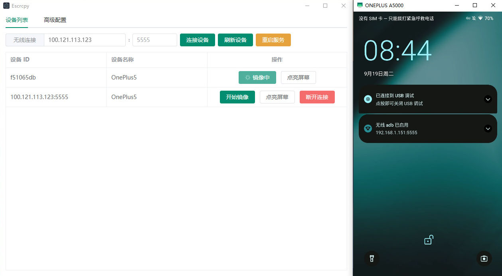

# Escrcpy

📱 使用图形界面的 Scrcpy 显示和控制您的 Android 设备，由 Electron 驱动

📱 Use Scrcpy with a graphical interface to display and control your Android device, driven by Electron

  

## 特点

- 🏃 同步：得益于 Web 技术，将更快速的与 Scrcpy 保持同步
- 😎 轻巧度：本机支持，仅显示设备屏幕
- ⚡️ 性能：30~120 帧每秒，取决于设备
- 🌟 质量：1920×1080 或更高
- 🕒 低延迟：35~70 毫秒
- 🚀 快速启动：显示第一张图片仅需约1秒钟
- 🙅‍♂️ 非侵入性：不会在安卓设备上留下任何安装文件
- 🤩 用户收益：无需账户、无广告、无需互联网连接
- 🗽 自由：免费且开源软件

## 获取软件包

[查看发布地址](https://github.com/viarotel-org/escrcpy/releases)

## 快速上手

### USB 连接

> 注意：如果手机上提示调试授权请点击允许

1. 安卓手机需开启开发者模式并打开 USB 调试
2. 打开 Escrcpy 并将安卓手机连接到你的电脑
3. 这时 Escrcpy 设备列表应该已经检测到你的手机，点击开始镜像
4. 开始享受吧

### WIFI 连接

> 注意：需同时开启无线调试功能，并在无线调试页面中获取你的当前设备的无线地址（通常为你连接WIFI时分配的IP地址）及端口号（默认为 5555）

1. 同 USB 连接中的 1-2 步骤
2. 将获取到的设备 IP 地址及端口号填写到 Escrcpy 中，然后点击连接设备
3. 这时 Escrcpy 设备列表应该已经检测到你的手机，点击开始镜像
4. 开始享受吧

## 快捷键

请参阅 [scrcpy/doc/shortcuts](https://github.com/Genymobile/scrcpy/blob/master/doc/shortcuts.md)

## 高级配置

> 持续完善中 目前支持 Scrcpy 中以下常用配置

### 显示配置

- 分辨率
- 比特率
- 刷新率
- 屏幕旋转
- 视频解码器
- 视频编码器

### 设备控制

- 保持设备清醒
- 连接设备后自动关闭屏幕

### 音频控制

- 镜像时禁用音频

### 窗口控制

- 无边框模式
- 全屏幕模式

## 下一步做什么？

> 优先级从高到低

1. 用户界面进行优化，制作合适的 Logo ✅
2. 内置的软件更新功能 ✅
3. 添加 macOS 及 linux 操作系统的支持 🚧
4. 添加外部控制栏 🚧
5. 支持语言国际化功能 🚧
6. 添加对游戏的增强功能 如游戏键位映射 🚧

## 常见问题

### 电脑连接设备后无法检测到

1. 请重新插拔你的设备，并确认设备同意了 USB 调试授权窗口。
2. 如果还不行，你的电脑可能缺少必要的驱动程序，请使用第三方工具 如：驱动精灵，安装必要的驱动后重试。

### 无法输入中文

该问题是已知的， Scrcpy 似乎并未直接对中文输入进行测试和支持 需要在手机端安装第三方输入法 以下输入法经测试可以很好支持

- 搜狗输入法
- QQ输入法
- 谷歌拼音输入法
- Gboard

### 没有控制栏，无法通过点击返回上一步及桌面问题

> 后期会增加支持 目前可以使用以下方法

1. 在高级设置中开启 设备控制 => 虚拟控制栏 （如果该配置不起作用则需要在设备上手动开启）
2. 通过快捷键，请参阅 [scrcpy/doc/shortcuts](https://github.com/Genymobile/scrcpy/blob/master/doc/shortcuts.md)

### 无线连接提示： 目标计算机积极拒绝访问

第一次无线连接可能需要配对 或 插入USB 以保证与电脑建立连接即授权成功后方可使用

## 获得帮助

> 因为是开源项目 全靠爱发电 所以支持有限 更新节奏不固定

- issues: [反馈问题](https://github.com/viarotel-org/escrcpy/issues)
- email: viarotel@qq.com
- weixin: viarotel
- qq: 523469508

## 致谢

该项目的诞生离不开以下开源项目

- [scrcpy](https://github.com/Genymobile/scrcpy)
- [adbkit](https://github.com/DeviceFarmer/adbkit)
- [electron](https://www.electronjs.org/)

## 支持项目

> 如果该项目帮到你的话，可以请我吃包辣条，可以使我更有动力完善该项目

  
  

