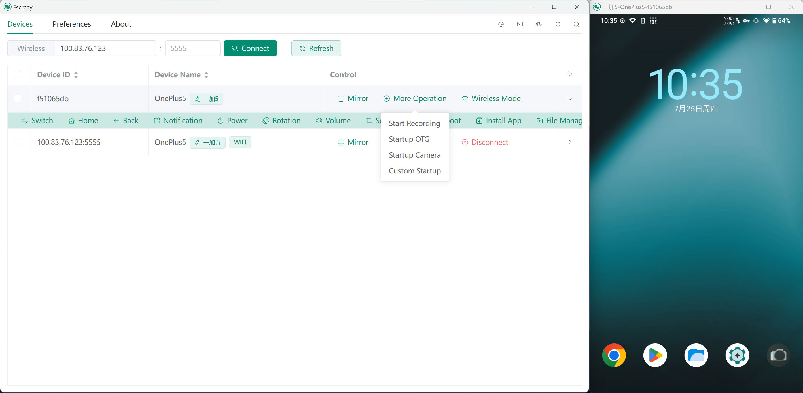

  

# Escrcpy

📱 Display and control your Android device with a graphical interface of Scrcpy powered by Electron. [中文文档](https://github.com/viarotel-org/escrcpy/blob/main/README-CN.md)

  

[More screenshots](https://github.com/viarotel-org/escrcpy/tree/main/screenshots/en-US)

## Features

- 🏃 Synchronous: Benefit from web technologies to synchronize with Scrcpy faster
- 🤖 Automation: Enables automatic connection to historical devices and automatic execution of mirror.
- 💡 Customizable: Support independent configuration for multiple devices and ability to add notes and import/export all configurations
- 🎨 Theme: Supports light mode and dark mode, system-wide switching
- 🔗 Gnirehtet: Integrated Gnirehtet's reverse tethering functionality
- 😎 Lightweight: Native support, only display device screen
- ⚡️ Performance: 30-120 fps depending on device
- 🌟 Quality: 1920×1080 or higher
- 🕒 Low latency: 35~70 ms
- 🚀 Quick startup: Display first image in about 1 second
- 🙅‍♂️ Non-intrusive: No installation residual left on Android device
- 🤩 User benefits: No account, no ads, no internet required
- 🗽 Free and open source

## Get Software Packages

[Check release addresses](https://github.com/viarotel-org/escrcpy/releases)

## Quick Start

### USB Connection

> Note: If the phone prompts for debugging authorization, click allow

1. Enable developer mode and USB debugging on your Android phone
2. Open Escrcpy and connect your Android phone to your computer
3. The device list in Escrcpy should have detected your phone, click start mirroring
4. Enjoy!

### WIFI Connection

> Note: Wireless debugging needs to be enabled on your phone's wireless debugging page to get the IP address (usually the IP assigned when connecting to WIFI) and port number (default 5555) of the device

1. Follow steps 1-2 in USB Connection
2. Input the device IP address and port number obtained to Escrcpy and click connect device
3. The device list in Escrcpy should have detected your phone, click start mirroring
4. Enjoy!

### macOS && Linux

> Note: These platforms do not come with integrated [Scrcpy](https://github.com/Genymobile/scrcpy), you need to install them manually

1. Refer to the [installation document](https://github.com/Genymobile/scrcpy/blob/master/doc/linux.md) for Linux
2. Refer to the [installation document](https://github.com/Genymobile/scrcpy/blob/master/doc/macos.md) for macOS
3. Follow steps in USB Connection and WIFI Connection after dependencies are installed successfully

### Gnirehtet Reverse Tethering

> Note: macOS does not have Gnirehtet built-in. You need to manually install it to use this feature [Installation Guide](https://github.com/Genymobile/gnirehtet).

Gnirehtet is built into the Windows and Linux apps to provide reverse tethering from PC to Android devices.

## Shortcuts

Refer to [scrcpy/doc/shortcuts](https://github.com/Genymobile/scrcpy/blob/master/doc/shortcuts.md)

## Device Operation

### Control Model

- Mirror
- Recording
- OTG
- Camera

### Device Interaction Bar

- Switch
- Home
- Back
- Notification
- Power
- Rotation
- Volume
- Screenshot
- Reboot
- Install APP
- File Manager
- Gnirehtet
- Mirror Group

## Preferences

> Continuously improving. Currently supports the following common configurations

### General

- Change theme
- Adjust language
- File storage path (for storing audio/video recordings and device screenshots)
- ADB path
- Scrcpy path
- Gnirehtet path
- Scrcpy parameters
- Auto-connect to historical devices
- Gnirehtet Fix
- Enable debugging

### Video Control

- Maximum size
- Video bitrate
- Refresh rate
- Video encoding
- Display orientation
- Screen clipping
- Monitor
- Video buffering
- Receiver (v4l2) buffering

### Device Control

- Show touch points
- Keep awake
- Turn off screen during control
- Turn off screen after control
- Disable auto-brightness during control
- Simulate auxiliary display

### Window Control

- Window width
- Window height
- Window X coordinate
- Window Y coordinate
- Borderless mode
- Fullscreen mode
- Always on top
- Disable screensaver

### Audio Control

- Audio source
- Audio encoding
- Audio bitrate
- Audio buffering
- Audio output buffering

### Audio/Video Recording

- Video recording format
- Video recording orientation
- Recording duration
- Disable video recording
- Disable audio recording
- Disable video playback
- Disable audio playback

### Input Control

- Mouse mode
- Keyboard mode
- Keyboard injection method

### Camera Control

- Enable camera
- Camera source
- Camera resolution
- Camera aspect ratio
- Camera frame rate

## Next Steps?

> Priority from high to low:

1. Optimize user interface, design a suitable logo ✅
2. Built-in software update function ✅
3. Record and save audio/video ✅
4. Add device quick interaction control bar ✅
5. Support customization of Adb and Scrcpy dependencies ✅
6. Support custom device name, and import/export of preference settings ✅
7. Customization, support independent configuration for individual devices ✅
8. Add support for macOS and linux operating systems ✅
9. Support internationalization ✅
10. Support for dark mode ✅
11. Add Gnirehtet reverse network function ✅
12. Add new camera mirror related features ✅
13. Better multi -screen collaboration ✅
14. Add more features to device interaction bar: file push, screen rotation, audio control etc ✅
15. Support bulk connecting to historical devices ✅
16. Support to use built-in terminals to execute custom commands ✅
17. Supports automatic execution of mirror on devices. ✅
18. Add file transmission assistant function 🚧
19. Support GUI-based selective file downloads from devices 🚧
20. Support grouping devices and bulk operations by group 🚧
21. Add game enhancement features such as game keyboard mapping 🚧

## FAQ

### Computer cannot detect device after connecting

1. Please unplug and reconnect your device, and make sure the device has granted USB debugging authorization.
2. If it still doesn't work, your computer may be missing necessary drivers. Please install drivers using third-party tools such as DriverWizard and try again.

### Unable to enter Chinese

This issue is known - Scrcpy doesn't seem to have tested and supported direct Chinese input. It's recommended to install a third-party input method on the phone that can well support, such as:

- Sogou Input
- QQ Input
- Google Pinyin Input
- Gboard

### Wireless connection prompts: The target computer actively refuses access

The first wireless connection may require pairing. Alternatively, insert USB to ensure connection establishment and authorization success before using wireless.

### Clicking wireless mode after connecting via data cable has no response

Please click again, or click refresh devices. Generally it will not exceed two clicks. If still not working, please provide device model and Android version to [Issues](https://github.com/viarotel-org/escrcpy/issues)

### Why is the device interaction control bar not designed as an automatically sticking floating menu?

Adopting the floating menu approach will inevitably increase coupling with Scrcpy and difficulty in synchronization updates. Many similar ScrcpyGUI softwares had to invest a lot of effort in this approach and eventually gave up development due to update difficulties. Therefore, taking overall considerations, we decided to adopt the existing approach and look forward to Scrcpy's native support for an interaction control bar in the future.

### Some devices can see screenshots after connecting but cannot operate

> Note: For Xiaomi phones in particular, it requires not only enabling USB debugging but also enabling USB debugging (Security Settings), which is to allow modifying permissions or simulating clicks via USB debugging.

Please refer to the detailed instructions under [Reasons why mouse and keyboard do not work](https://github.com/Genymobile/scrcpy/blob/master/FAQ.md#mouse-and-keyboard-do-not-work)

### Downloading prompts antivirus detection causing unable to download normally

> After feedback, Windows Defender may occasionally block the software packages from being downloaded due to lack of certificate signing. You can try the following solutions:

1. Open `Windows Security Center`.
2. Select `Virus & threat protection`.
3. In the `Virus & threat protection settings`, click `Manage settings`.
4. Find `Real-time protection`, you can try clicking Disable if permission allows. If unable to disable real-time protection, please skip this step.
5. Scroll down the page, find `Exclusions`, click `Add or remove exclusions`.
6. Add the folder path where you download the software packages as an exclusion item, i.e. add the folder to the `Excluded list`.

### Failed to get device list or error when starting mirroring/recording

> This is generally caused by an incorrect path for `Adb` or `Scrcpy`, you can try the following solutions:

1. In the menu, select `Preferences` and then click the reset configuration button in the top right corner of `Global Mode`.
2. Go to the `Device List` page and try enabling mirroring again.
3. Make sure you have downloaded and installed the latest version of `Escrcpy`.
4. Press `Ctrl` + `Shift` + `I` to open the developer tools and check for any error messages.
5. If there are errors, take a screenshot and submit your issue with the screenshot on the [Feedback Issues](https://github.com/viarotel-org/escrcpy/issues) page.

### macOS window minimized to system tray icon not found

> This is generally caused by too many icons in the system tray overflowing and hiding the Escrcpy icon. Try using the following tools:

- [iBar](https://www.better365.cn/ibar.html)
- [Bartender](https://www.macbartender.com/)

### After a successful installation of macOS, when I try to open it, I receive a prompt saying the file is damaged.

> This is usually due to the software package not being signed. You can try the following solutions:

1. Open Terminal and execute `sudo spctl --master-disable` to allow software from any source.
2. Open Terminal and execute `sudo xattr -r -d com.apple.quarantine [AppPath]` to attempt fixing the damaged software package prompt.

### Unable to locate the input point DiscardvirtualMemory on the dynamic link library Kernel32.dll.

Only support `Windows 10` and above versions.

### Audio capture exception causing mirroring failure.

> This usually happens because your computer lacks audio output or you have a low Android version (Android 11+).

Please try `disabling audio forwarding` feature through the `preferences settings` to resolve this issue.

## Getting Help

> As this is an open source project run entirely by donations, support is limited and updates may not be on a fixed schedule.

- Issues: [Submit Feedback](https://github.com/viarotel-org/escrcpy/issues)
- Email: viarotel@qq.com
- WeChat: viarotel
- QQ: 523469508

## Acknowledgements

This project would not be possible without the following open source projects:

- [scrcpy](https://github.com/Genymobile/scrcpy)
- [adbkit](https://github.com/DeviceFarmer/adbkit)
- [electron](https://www.electronjs.org/)
- [vue](https://vuejs.org/)
- [gnirehtet](https://github.com/Genymobile/gnirehtet/)

## Support the Project

> If this project has helped you, you can buy me a coffee to keep me energized and improving the project! 😛

  
  
  

## Contributors

Thanks for all their contributions!

## Star History

